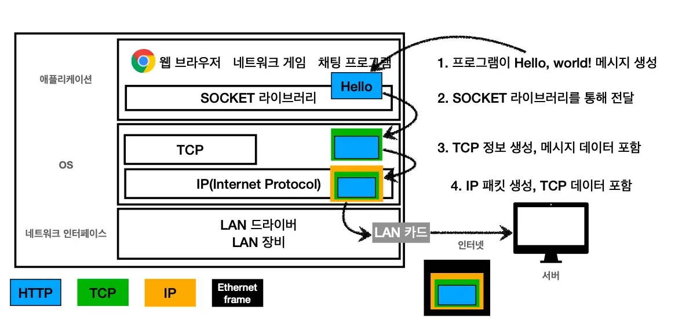

# 학습 노트 스타일 가이드 (마이그레이션용)

> 모든 마이그레이션 md 파일은 이 규칙을 따른다.
> 시범: `docs/network/http.md`

## 1. Frontmatter (모든 파일 의무)

```yaml
---
title: HTTP                        # 한국어/영문 원본 제목
slug: http                          # 영문 슬러그 (kebab-case)
category: network                   # 카테고리 슬러그 (계층은 / 구분)
summary: HTTP 프로토콜의 특징, URI, 메시지 구조와 메서드/상태 코드 정리
tags: [network, http, protocol]     # 검색·그래프용 태그 (소문자, kebab-case)
sort_order: null                    # 카테고리 내 표시 순서 (없으면 null)
created: 2025-01-17                 # 최초 작성일 (원본 이미지 타임스탬프 기반)
updated: 2026-05-10                 # 정리일
---
```

규칙:
- `title`: 한글 원본 우선 (영문이 명확한 기술용어면 영문)
- `summary`: 1줄, 50~80자. SEO 메타 description 으로도 사용
- `tags`: 3~6개. 카테고리 슬러그를 하나는 포함

## 2. 본문 구조

- frontmatter 직후 **H1 생략** (frontmatter title과 중복)
- 바로 `## 1. 섹션명` 부터 시작
- 섹션 구분자 `***` **제거** (H2가 구분 역할)
- 헤딩 번호: `## 1.`, `## 2.` (zero-padding 없음)
- 부 섹션: `### 1.1`, `### 1.2`

## 3. 문장

- **종결어미**: 명사형 통일 (`~함`, `~됨`, `~임`)
  - 서술형(`~한다`, `~된다`)과 혼용 금지
  - 짧은 항목은 명사구로 끝 (예: "패킷 단위로 전달")
  - 변환 예:
    - 데이터를 전달한다 → 데이터를 전달함
    - 패킷이 전송된다 → 패킷이 전송됨
    - 구분이 모호하다 → 구분이 모호함
    - 추가된다 → 추가 (또는 추가됨)
    - 신뢰할 수 있는 프로토콜이다 → 신뢰할 수 있는 프로토콜
- **콜론**: 공백 없이 붙임 → `IP: 클라이언트와 서버가...` (`IP : ...` 금지)
- **맞춤법** 사전 (자동 치환):
  | 잘못 | 올바름 |
  |---|---|
  | 메세지 | 메시지 |
  | Java script | JavaScript |
  | SOKET | Socket |
  | 통신하기위해 | 통신하기 위해 |
  | 게임을하면서 | 게임을 하면서 |
  | 사용자정보 | 사용자 정보 |
  | 도메인명 | 도메인 명 |
  | TCP사용 | TCP 사용 |
  | 두 칸 공백 | 한 칸 공백 |

## 4. 불릿 / 들여쓰기

- 들여쓰기: **2 spaces** (탭 금지)
- **최대 3단계**까지. 그 이상 깊어지면 sub-section(`###`)으로 분리
- 번호 리스트(`1.`, `2.`)는 순서가 의미 있을 때만

## 5. 이미지

- 본문 줄에 붙이지 말고 **자체 줄**에 배치
- alt 텍스트는 **의미 있게** (원본 파일명 그대로 X)
- 위/아래 빈 줄 1개씩

```markdown
앞 문장이 끝났다.



다음 문장이 이어진다.
```

## 6. 코드 / 인라인 강조

- 코드/명령/식별자: \`backtick\`
- 의사 코드 블록: ```` ``` ````
- 강조: `**굵게**`만 사용 (이탤릭 `*` 금지)

## 7. 표 활용 권장

비교/매핑 가능한 정보는 불릿 대신 **표로**:

```markdown
| 메서드 | 용도 |
|---|---|
| GET | 리소스 조회 |
| POST | 처리 요청 |
```

## 8. 데이터 검증 / 보강 정책

- **명백한 오류**: 즉시 수정 (예: "IP 번호" → "IP 주소", "ACK+SYN" → "SYN+ACK")
- **표준 용어 보강 허용**: 학습에 도움이 되는 표준 명칭/용어는 추가 가능
  (예: "지속 연결" → "지속 연결(Keep-Alive)")
- **어색한 문장 의역 허용**: 의미를 유지하는 범위에서 자유롭게 다듬음
- **별도 정정 표시 불필요**: 본문에 자연스럽게 통합
